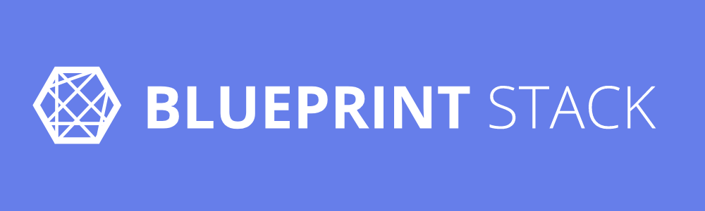

  
    

An awesome API blueprint playground for new people to experiment on.

## ℹ️ About

BlueprintStack helps people to experiment with the awesome API blueprint specification easily. No account required, multiple blueprint files, automatic preview updates and, saving your blueprints locally.

BlueprintStack is an improved version of the previous playground I build about a year ago called <a href="https://blueprint-dash.surge.sh">blueprint-dash</a>. The idea behind the rewrite is that blueprint-dash was missing some key features that I thought would be nice to have. Also, some react patterns could be better implemented and I really wanted to try out Next.js for something not that complicated.

## 💥 Features

- No account required
- Multiple blueprint files
- Automatic preview updates (while typing)
- Blueprints saved locally

## ❗️ Notice

This is a playground for quick access to the spec. If you are serious about working with API blueprint for your project/product I recommend the official <a href="https://apiary.io/">apiary</a> platform by Oracle.

## 📜 License

<a href="./LICENSE">MIT</a>

##

<b>Visit <a href="https://blueprintstack.io">blueprintstack</a> now! ❤️</b>

If you like this project, do leave a star and because I'm not planning to heavily maintain this project feel free to submit any PR that fixes a bug or improves the playground. 🙏
